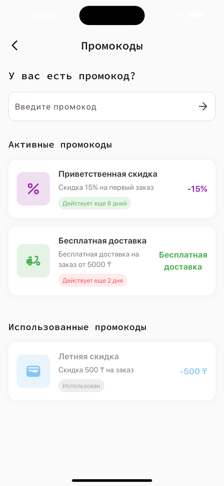

# Malina Shop Design System

Malina Shop is a modern e-commerce mobile application that combines food delivery and cosmetics shopping in a single platform. Built with Flutter, it features a clean, intuitive interface and seamless user experience.

## Features

### Screens

<table>
  <tr>
    <td></td>
    <td></td>
    <td></td>
    <td></td>
  </tr>
  <tr>
    <td></td>
    <td></td>
    <td></td>
    <td></td>
  </tr>
  <tr>
    <td></td>
    <td></td>
    <td></td>
    <td></td>
  </tr>
</table>

## Technical Stack

### UI Components
- flutter_svg: ^2.0.10+1
- cached_network_image: ^3.3.1
- google_fonts: ^6.2.1
- flutter_staggered_grid_view: ^0.7.0
- sliver_tools: ^0.2.12

### Animations
- flutter_animate: ^4.1.0
- flutter_staggered_animations: ^1.1.1
- shimmer: ^3.0.0

### Storage & Services
- shared_preferences: ^2.2.2
- mobile_scanner: ^6.0.2

## Architecture

### Asset Management
The project uses a custom asset generation system that automatically creates constants for all assets:
- Images
- Vectors/Icons
- Fonts

### Theme System
- Supports light and dark modes
- Custom color schemes
- Google Fonts integration
- Consistent typography scale

### Localization
- Multi-language support
- RTL compatibility
- Locale-based formatting

## Custom Components

### AppIcon
A unified icon system that supports:
- SVG icons
- Size customization
- Color overrides
- Original color preservation

### CustomizedPopupMenu
A flexible popup menu system featuring:
- Custom positioning
- Animation controls
- Direction support (top/bottom)
- Barrier customization

### CornerPainter
A custom painter for creating:
- Rounded corners
- Custom border styles
- Scanner overlay effects

## Getting Started

1. Clone the repository:
```bash
git clone https://github.com/TaalayDev/malina_shop.git
```

2. Install dependencies:
```bash
flutter pub get
```

3. Generate localizations:
```bash
flutter gen-l10n
```

4. Run the application:
```bash
flutter run
```

## Development Guidelines

### Code Style
- Follow Flutter's official style guide
- Use meaningful variable and function names
- Document complex functionality
- Keep widgets focused and modular

### Asset Management
- Place new images in `assets/images/`
- Place vector icons in `assets/vectors/`
- Run asset generation after adding new assets:
```bash
./generate_assets.sh
```

### Theme Updates
- Modify `lib/core/theme/theme.dart` for global theme changes
- Use theme colors and text styles consistently
- Test changes in both light and dark modes

## Contributing

1. Fork the repository
2. Create your feature branch
3. Commit your changes
4. Push to the branch
5. Create a Pull Request

## License

This project is licensed under the MIT License - see the LICENSE file for details.

## Acknowledgments

- Design inspiration from [Figma Design System](https://www.figma.com/design/G5R1isGMNHlRsFoH5RnnR2/)
- Icon set from custom vector designs
- Flutter team for the amazing framework